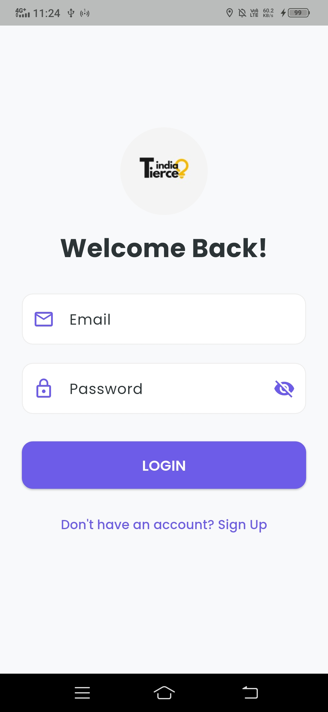
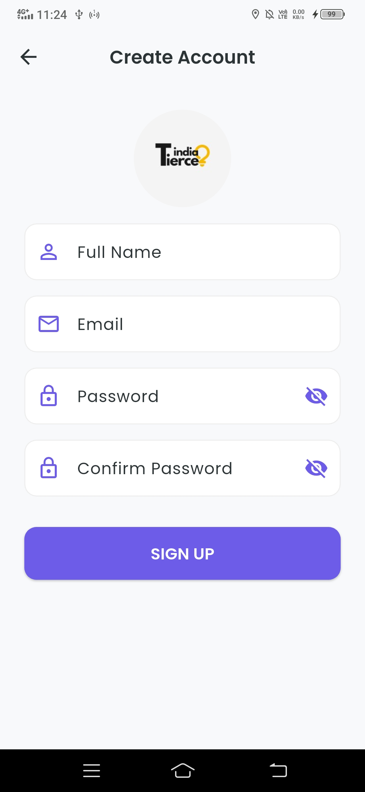
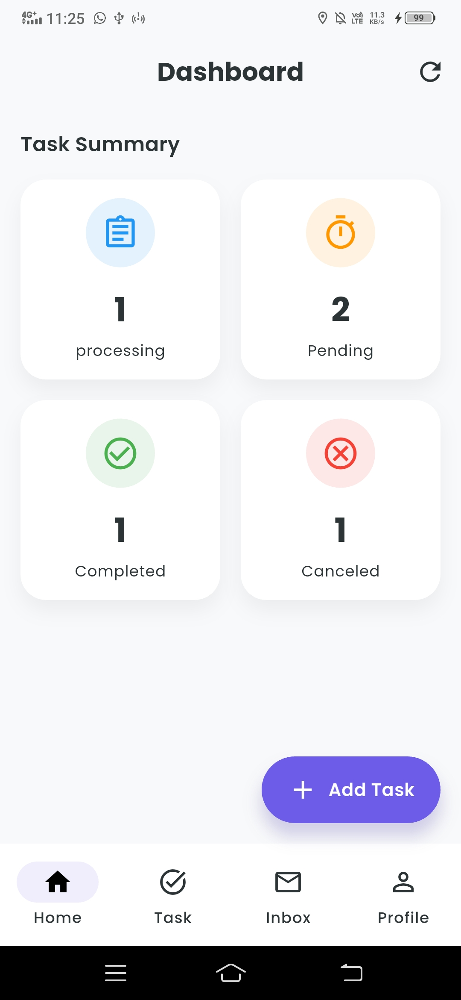
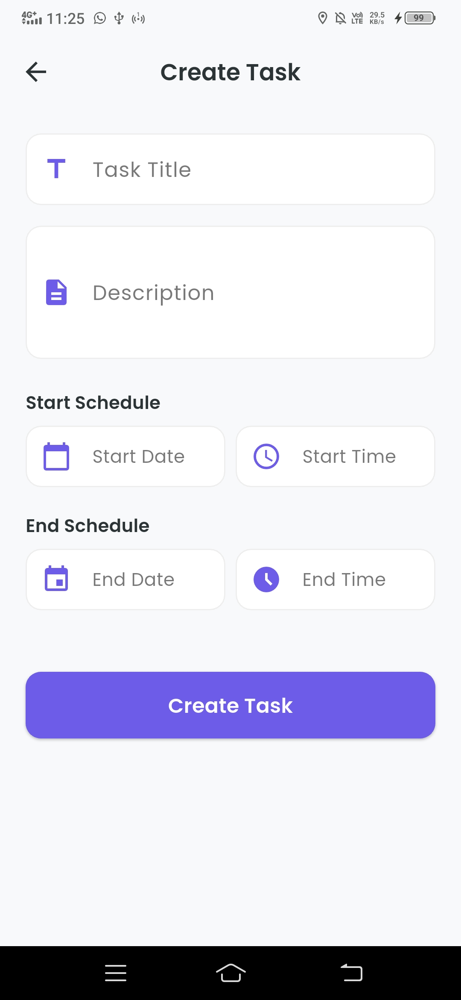
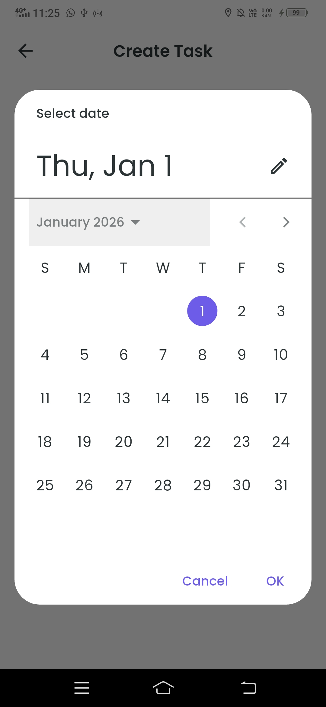
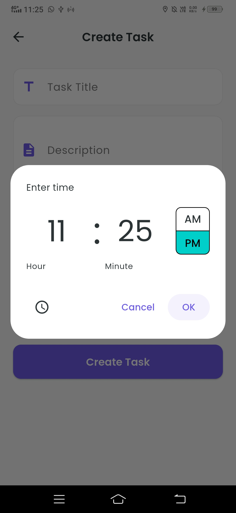
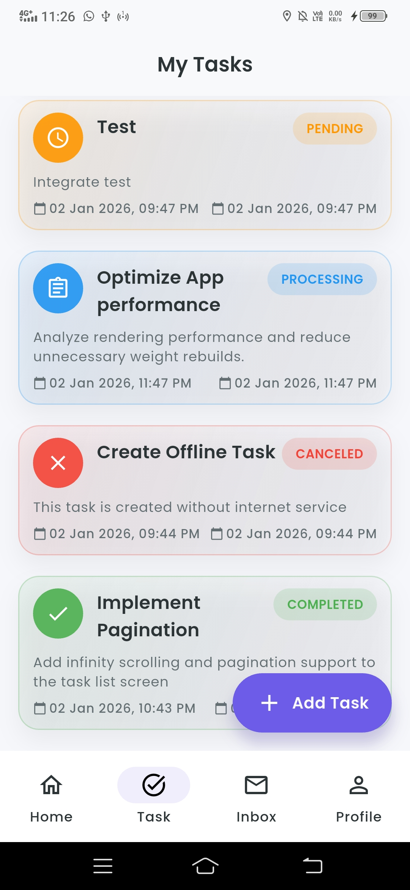
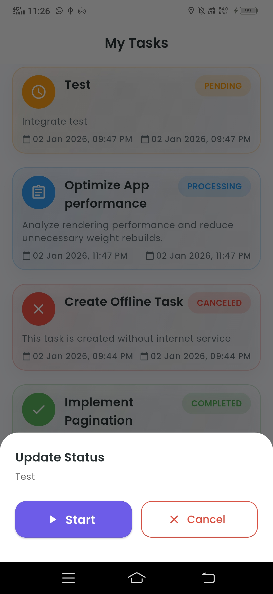
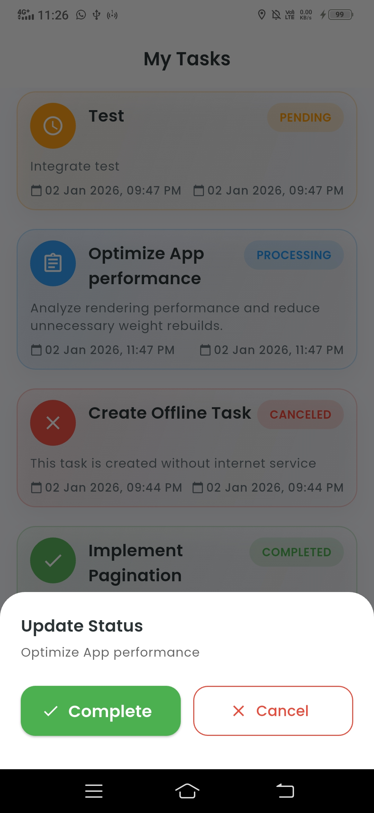

# 📝 Smart Task Manager

A **production-ready, offline-first mobile application** built with **Flutter** that demonstrates **Clean Architecture**, robust **state management**, and **seamless online–offline synchronization**.

---
## 📱 App Screenshots

<p align="center">
  
  
  
</p>

<p align="center">
  
  
  
</p>

<p align="center">
  
  
  
</p>

<p align="center">
  
  
</p>

## ⏱️ Development Timeline

> **Expected Time:** 24 hours
> **Actual Time:** 36 hours

**Why the extension?**
To demonstrate a realistic **full‑stack production workflow**, I intentionally avoided mock APIs. Instead, I designed, implemented, and deployed a **custom Node.js + Express backend** and **MySQL Database** on a live **AWS EC2 instance**. This ensures the application handles:

* Real network latency
* Authentication & token rotation
* Error states (401, 403, 500)
* Offline-to-online sync scenarios

---

## 🏗 Architecture Overview

## 🏗 Project Structure

This project follows **Clean Architecture** with a **Feature-First** approach.

```text
lib/
├── config/                 # App Configuration (Routes, Themes)
│   ├── routes.dart
│   └── theme.dart
├── core/                   # Core utilities shared across features
│   ├── error/              # Custom Exceptions & Failures
│   ├── network/            # Dio Client & Network Info (Interceptors)
│   ├── utils/              # Constants, Validators, Sizes, Colors
│   └── widgets/            # Shared UI Components (CustomSnackbar)
├── features/               # Independent feature modules
│   ├── auth/               # Authentication (Login, Signup)
│   ├── dashboard/          # Main Container (Bottom Nav)
│   ├── home/               # Home Tab (Statistics & Summary)
│   ├── profile/            # User Profile
│   ├── splash/             # Splash Screen
│   └── tasks/              # Task Management Core Feature
│       ├── data/           # Data Layer
│       │   ├── datasources/# Remote (API) & Local (Drift) sources
│       │   ├── models/     # JSON & DB Models
│       │   └── repositories/# Repository Implementation
│       ├── domain/         # Domain Layer
│       │   └── repositories/# Abstract Interfaces
│       └── presentation/   # Presentation Layer
│           ├── controllers/# GetX Controllers (State Management)
│           └── pages/      # Flutter Widgets (Screens)
├── injector_container.dart # Dependency Injection (GetIt/GetX)
└── main.dart               # Application Entry Point
```

---

The project follows **Clean Architecture** combined with **Feature‑First modularization**, ensuring:

* Clear separation of concerns
* High scalability
* Easy testability and maintainability

### 🔹 Architecture Layers

#### 1️⃣ Presentation Layer (UI)

* **State Management:** GetX (Obx, Rx variables)
* **Dependency Injection:** GetX DI
* **UI Design:** Modular and reusable widgets

  * Examples: `TaskCard`, `StatusChip`

Responsibilities:

* Rendering UI
* Reacting to state changes
* Triggering use cases

---

#### 2️⃣ Domain Layer (Business Logic)

* **Entities:** Pure Dart models
* **Repositories:** Abstract contracts

Key Principles:

* Framework independent (no Flutter / GetX / API code)
* Contains only business rules

---

#### 3️⃣ Data Layer (Data Handling)

* **Repository Implementations:** Decide between local or remote data sources
* **Data Sources:**

  * **Remote:** Dio client with interceptors for JWT (access & refresh tokens)
  * **Local:** Drift (SQLite) for offline persistence

Supports:

* Offline‑first experience
* Optimistic UI updates
* Reliable data synchronization

---

## 🔌 Backend API & Deployment

A custom **RESTful API** was developed using **Node.js & Express** and deployed on **AWS EC2**.

**Base URL:**

```
http://3.110.158.173
```

### 📌 Implemented Endpoints

* `POST /user/create_user` – Register new user
* `POST /user/login` – Login & retrieve access/refresh tokens
* `POST /user/refresh-token` – Token rotation
* `GET /tasks` – Fetch all user tasks
* `POST /tasks` – Create a task
* `PATCH /tasks/:id` – Update task status (syncs local → server)
* `DELETE /tasks/:id` – Delete task permanently

---

## 🧠 Key Technical Decisions

### 1️⃣ Why Drift (SQLite) over Hive / SharedPreferences?

**Decision:** Drift (SQLite)

**Reason:**

* Task management requires relational queries
* Filtering by status
* Sorting by timestamps
* ACID compliance ensures safer sync logic than key‑value storage

---

### 2️⃣ Why GetX for State Management?

**Decision:** GetX

**Reason:**

* Minimal boilerplate compared to BLoC
* Built‑in dependency injection
* Reactive programming using `.obs`
* Perfect fit for **optimistic UI updates** in offline‑first apps

---

### 3️⃣ Custom Backend instead of Firebase

**Decision:** Node.js + Express backend

**Reason:**

* Most real‑world systems use REST/GraphQL APIs
* Demonstrates backend ownership
* Fine‑grained control over:

  * Authentication
  * Authorization
  * Error handling
  * Token lifecycle

---

## ⚖️ Trade‑offs

### 1️⃣ HTTP vs HTTPS

**Trade‑off:** Backend currently runs on HTTP

**Impact:**

* Data is not encrypted in transit

**Why:**

* SSL setup and domain configuration would increase setup time
* Focused on demonstrating architecture, sync logic, and deployment

---

### 2️⃣ Sync Conflict Resolution

**Trade‑off:** Last‑Write‑Wins strategy

**Impact:**

* Concurrent edits from multiple devices may override previous changes

**Why:**

* Advanced conflict resolution (CRDTs / OT) is out of scope for a 24–36 hour task
* Current logic handles the vast majority of single‑user scenarios reliably

---

## 🚀 Improvements With More Time

### 🔐 Security

* Enable HTTPS using **Let’s Encrypt + Nginx**
* Hide API base URL using compile‑time variables (`--dart-define`)

### 🧪 Testing

### Unit Testing (Business Logic)

* Focuses on **Domain & Controller logic**
* Mocks repository dependencies
* Ensures predictable behavior without UI

Tests are placed under:

```text
test/
├── features/
│   └── tasks/
│       └── domain/
│           └── task_controller_test.dart
```

### Integration Testing

Integration tests validate **end-to-end app flows** including:

* App launch
* Login
* Task creation
* UI + backend interaction

Located at:

```text
integration_test/
└── app_test.dart
```

* Increase unit test coverage for repositories
* Add integration tests for:

  * Network switching
  * Sync failure & recovery

### ✨ Features

* Push notifications for task reminders
* WebSockets for real‑time multi‑device sync
* Background sync service

---

## 🔗 Repository

GitHub: [https://github.com/hansraj3160/smart-task-manager.git](https://github.com/hansraj3160/smart-task-manager.git)


---

## 🛠 Setup & Installation

### 1️⃣ Clone Repository

```bash
git clone https://github.com/hansraj3160/smart-task-manager.git
```

### 2️⃣ Install Dependencies

```bash
flutter pub get
```

### 3️⃣ Run Code Generation (Drift)

```bash
dart run build_runner build --delete-conflicting-outputs
```

### 4️⃣ Run the App

```bash
flutter run
```
### 4️⃣ Run test

```bash
flutter test
```

### 4️⃣ Run Integration test

```bash
flutter test integration_test/app_test.dart
```
### 4️⃣ Apk

```bash
https://drive.google.com/file/d/1IHQig60qvGpkPGipWOGZQI2Efq298jxJ/view?usp=sharing
```

---

## ✅ Summary

This project demonstrates **real‑world mobile engineering practices** including:

* Clean Architecture
* Offline‑first data handling
* Token‑based authentication
* Custom backend deployment
* Production‑ready Flutter patterns

Designed to scale, test, and evolve — exactly how modern mobile applications are built.
